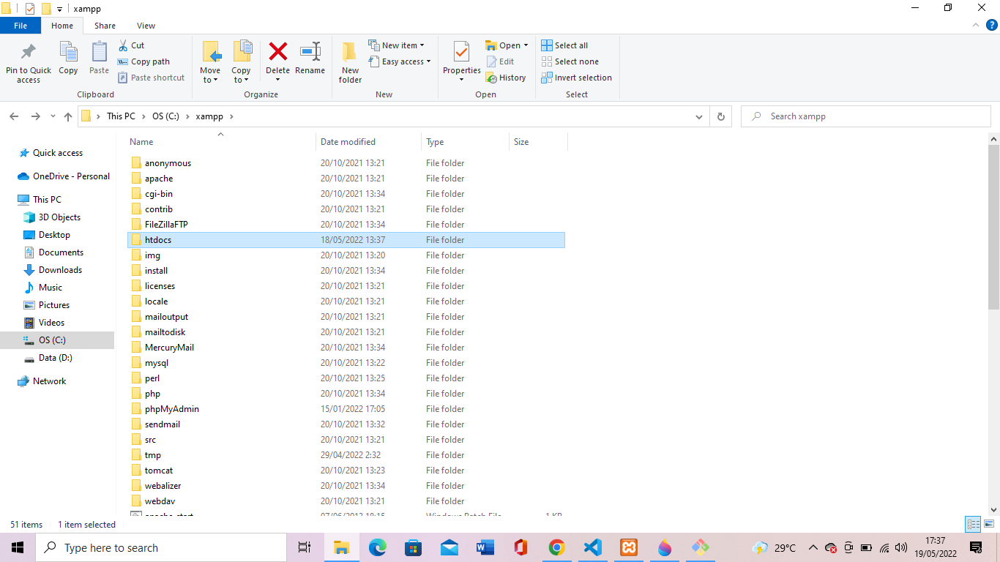
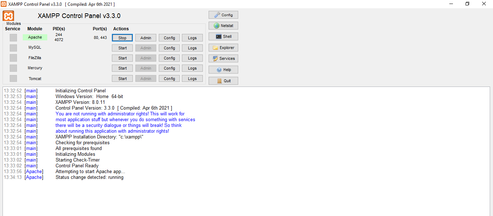
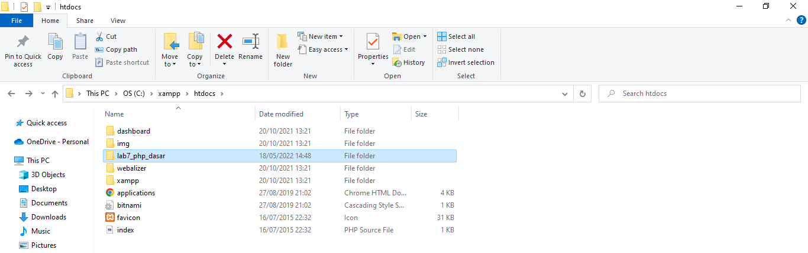
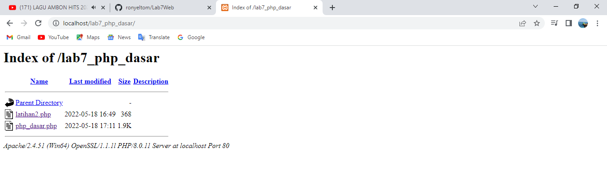
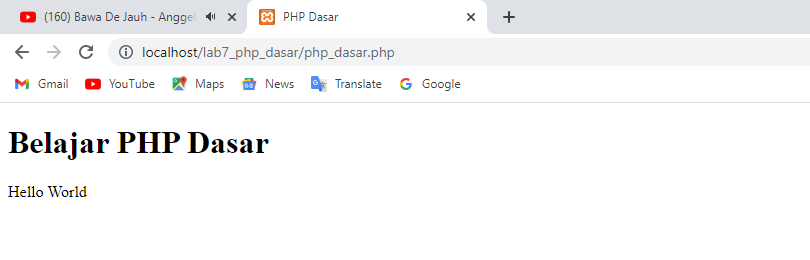

# Lab7Web PHP Dasar
## Nama : Rony Eltom Atibaman
## NIM : 312010003
## Kelas : TI.20.D.1

### Instal XAMPP
* Unduh XAMPP dari http://www.apechefriends.org/download.html dan pilih versi portable untuk memudahkan proses instalasi. kemudian exctract file tersebut, sesuaikan directorinya (misal: c:\xampp).<br>
<br>

### Menjalankan Web Server
* untuk menjalankan web server dari menu XAMPP Control<br>
<br>

### Memulai PHP
* Buat folder lab7_php_dasar pada root directory web server (c:\xampp\hotdocs).<br>
<br>
* kemudian untuk mengakses directory tersebut pada web server dengan mengakses URL:http://localhost/lab7_php_dasar/ <br>


### PHP Dasar
* Buat file baru dengan nama php_dasar.php pada directory tersebut. Kemudian buat kode seperti berikut.<br>
```<!DOCTYPE html>
<html lang="en">
<head>
    <meta charset="UTF-8">
   <title>PHP Dasar</title>
</head>
<body>
    <h1>Belajar PHP  Dasar</h1>
    <?php
        echo "Hello World";
    ?>
</body>
</html>
```

> kemudian untuk mengakses hasilnya melalui URL: http://localhost/lab7_php_dasar/php_dasar.php<br>



