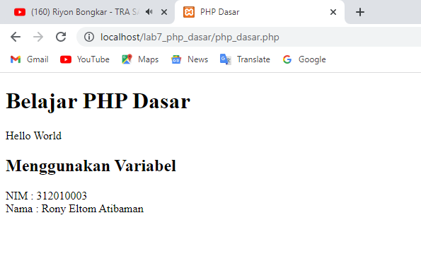
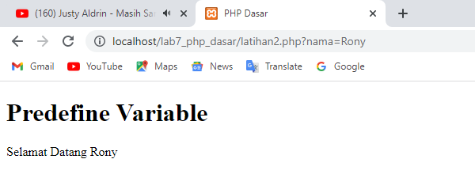
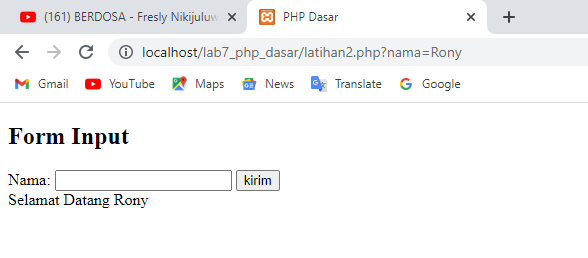
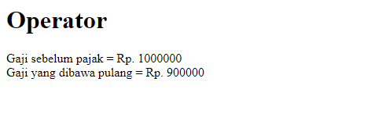
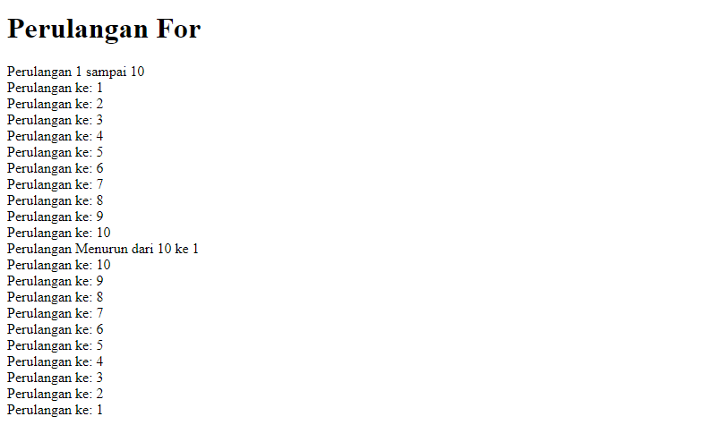
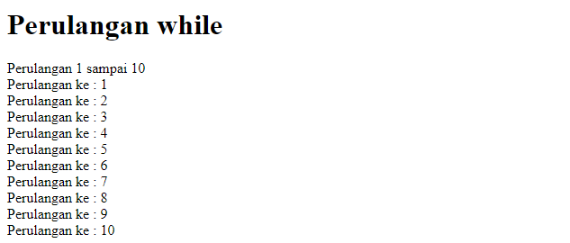
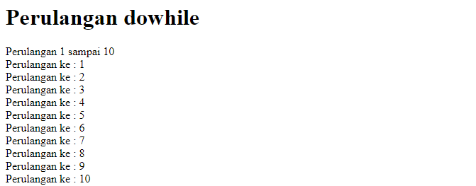
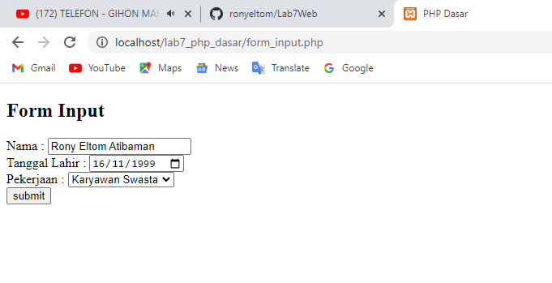
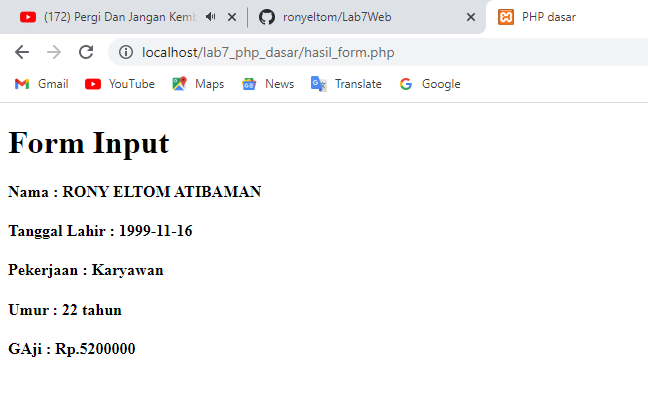

# Lab7Web PHP Dasar
## Nama : Rony Eltom Atibaman
## NIM : 312010003
## Kelas : TI.20.D.1

### Instal XAMPP
* Unduh XAMPP dari http://www.apechefriends.org/download.html dan pilih versi portable untuk memudahkan proses instalasi. kemudian exctract file tersebut, sesuaikan directorinya (misal: c:\xampp).<br>
<br>

### Menjalankan Web Server
* untuk menjalankan web server dari menu XAMPP Control<br>
<br>

### Memulai PHP
* Buat folder lab7_php_dasar pada root directory web server (c:\xampp\hotdocs).<br>
<br>
* kemudian untuk mengakses directory tersebut pada web server dengan mengakses URL:http://localhost/lab7_php_dasar/ <br>


### PHP Dasar
* Buat file baru dengan nama php_dasar.php pada directory tersebut. Kemudian buat kode seperti berikut.<br>
```<!DOCTYPE html>
<html lang="en">
<head>
    <meta charset="UTF-8">
   <title>PHP Dasar</title>
</head>
<body>
    <h1>Belajar PHP  Dasar</h1>
    <?php
        echo "Hello World";
    ?>
</body>
</html>
```

> kemudian untuk mengakses hasilnya melalui URL: http://localhost/lab7_php_dasar/php_dasar.php<br>

contoh gambar:<br>


### variable PHP
* Menambahkan variable pada program.
``` <h1>Menggunakan Variabell</h1>
    <?php
    $nim = "312010003";
    $nama = 'Rony Eltom Atibaman';
    echo "NIM : " . $nim . "<br>";
    echo  "Nama : $nama";
    ?> 
```
contoh gambar :<br>


### Predefine Variable
``` <?php
    echo 'Selamat Datang ' . $_GET['nama'];
    ?>
```
> untuk mengaksesnnya gunakan URL: http://localhost/lab7_php_dasar/latihan2.php?nama=Rony <br>

contoh gambar:<br>


### Membuat Form Input
* form di HTML dapat kita buat dengan tag `<form>`. tag ini memiliki beberapa atribut yang harus diberikan, seerti: `action` untuk menentukan aksi yang akan dilakukan saat data dikirim: `method` metode pengiriman data.

```<!DOCTYPE html>
<html lang="en">
<head>
    <meta charset="UTF-8">
    
    <title>PHP Dasar</title>
</head>
<body>
<h2>Form Input</h2>
<form method="post">
    <label>nama: </label>
    <input type="text" name="nama">
     <input type="submit" value="kirim">
</form>
    <?php
    echo 'Selamat Datang ' . $_GET['nama'];
    ?>
    
</body>
</html>
```
> contoh gambar:<br>


### Operator
* Membuat operator pada program.

```<h1>Operator</h1>
    <?php
    $pajak = 0.1 ;
    $gaji = 1000000;
    $thp = $gaji - ($gaji * $pajak);
        echo "Gaji sebelum pajak = Rp. $gaji <br>";
        echo "Gaji yang dibawa pulang = Rp. $thp";
    ?>
```
> contoh gambar:<br>


### Kondisi IF
* Pengambilan keputusan (kondisi IF) digunakan untuk mengantisipasi kondisi yang terjadi saat jalannya program dan menentukan tindakan apa yang akan diambil sesaui dengan kondisi.
```<h1>Kondisi IF</h1>
    <?php
    $nama_hari = date("1");
    if ($nama_hari == "Sunday") {
        echo "Minggu";
    } elseif ($nama_hari == "Monday") {
        echo "Senin";
    } else {
        echo "Selasa";
    }
    ?>
```
> contoh gambar:<br>


### Kondisi Switch
* kondisi SWITCH CASE adalah percabangan kode program dimana kita membandingkan isi sebuah variabel dengan beberapa nilai. jika proses perbandingan tersebut menghasilkan true, maka block kode program akan di proses.

```<h1>Kondisi Switch</h1>
    <?php
    $nama_hari =date("1");
    switch ($nama_hari) {
        case "Sunday":
            echo "Minggu";
            break;
        case "Monday" :
            echo "Senin";
            break;
        case "tuesday":
            echo "Selasa";
            break;
        default :
            echo "Sabtu"; }
    ?>
```
> contoh gambar:<br>


### Perulangan for 
* perulangan for biasanya menggunakan suatu variabel untuk mengendalikan berapa kali tubuh loop akan dieksekusi dan menentukan kapan loop akan berhenti.

```<h1>Perulangan For</h1>
    <?php
    echo "Perulangan 1 sampai 10 <br />";
    for ($i=1; $i<=10; $i++) {
        echo "Perulangan ke: " . $i . '<br />';
    }

    echo "Perulangan Menurun dari 10 ke 1 <br />";
    for ($i=10; $i>=1; $i--) {
        echo "Perulangan ke: " . $i . '<br />';
    }
    ?>
```
> contoh gambar: <br>


### Perulangan While
* perulangan while adalah perulangan yang bersifat indefinite alias tidak pasti, atau bahkan tidak terbatas. Sebuah blok kode akan dilakukan terus-menerus selama suatu kondisi terpenuhi. Jika suatu kondisi ternyata tidak terpenuhi pada interasi ke 10, maka perulangan akan berhenti.

```<h1>Perulangan while</h1>
    <?php
    echo "Perulangan 1 sampai 10 <br />";
    $i=1;
    while ($i<=10) {
        echo "Perulangan ke : " . $i . '<br />';
        $i++;
    }
    ?>
```
> contoh gambar:<br>


### Perulangan do While
* Perulangan DO While merupakan modifikasi dari perulangan WHILE, yakni dengan memindahkan posisi pemeriksaan kondisi ke akhir perulangan. Artinya, lakukan dulu sebuah perulangan, beru periksa apakah kondisi variabel counter sudah terpenuhi atau belum di akhir perulangan.

```<h1>Perulangan dowhile</h1>
    <?php
    echo "Perulangan 1 sampai 10 <br />";
    $i=1;
    do {
        echo "Perulangan ke : " . $i . '<br />';
        $i++;
    } while ($i<=10);
    ?>
```
> contoh gambar:<br>



## Pertanyaan dan Tugas
* Buatlah program PHP sederhana dengan menggunakan form input yang menampilkan nama, tanggal lahir dan pekerjaan. Kemudian tampilkan outputnya dengan menghitung umur berdasarkan inputan tanggal lahir. Dan pilihan pekerjaan dengan gaji yang berbeda-beda sesuai pilihan pekerjaan.

### Membuat Form Input
* Pertama tama membuat form input nya, berikut kodinganya.

```<!DOCTYPE html>
<html lang="en">
<head>
    <meta charset="UTF-8">
    <meta http-equiv="X-UA-Compatible" content="IE=edge">
    <meta name="viewport" content="width=device-width, initial-scale=1.0">
    <title>PHP Dasar</title>
</head>
    <body>
        <h2>Form Input</h2>
        <form style="" action="hasil_form.php" method="post">
            Nama :
                <input type="text" name="nama" id="nama">
                <br>
            Tanggal Lahir :
            <input type="date" name="tgl_lahir" id="tgl_lahir">
                <br>
            Pekerjaan :
                <select name="pekerjaan" id="pekerjaan">
                    <option value="guru">Guru</option>
                    <option value="karyawan">Karyawan Swasta</option>
                    <option value="dokter">Dokter</option>
                </select>
                <br>
            <input type="submit" value="submit" name="submit">
        </form>
</body>
</html>
```
> kemudian akses hasilnya melalui URL:http://localhost/lab7_php_dasar/form_input.php<br>
> hasil kodingan:<br>


### Membuat hasil Input
* Kemudian membuat hasil inputan formnnya, kodingan seperti ini.

```<?php
if (isset($_POST['submit'])){ 
$nama = $_POST['nama'];
$tgl_lahir = $_POST['tgl_lahir'];
$pekerjaan = $_POST['pekerjaan'];

function hitung_umur($tgl_lahir){
	$birthDate = new DateTime($tgl_lahir);
	$today = new DateTime("today");
	if ($birthDate > $today) { 
	    exit("0 tahun 0 bulan 0 hari");
	}
	$y = $today->diff($birthDate)->y;
    return $y." tahun ";
    
}

if ($pekerjaan == "guru") {
    $gaji = "Rp.5500000";
} elseif ($pekerjaan == "karyawan") {
    $gaji = "Rp.5200000";
} elseif ($pekerjaan == "dokter") {
    $gaji = "Rp.10000000";
} else {
}

$umur = hitung_umur($tgl_lahir);
echo "
<html>
        <body>
            <h1>Form Input</h1>
            <p>Nama : $nama</p>
            <p>Tanggal Lahir: $tgl_lahir </p>
            <p>Pekerjaan : $pekerjaan </p>
            <p>Umur : $umur </p>
            <p>Gaji: $gaji </p>
        </body>
</html>
";}
?>
```

> Kemudian saat kita klik `submit` pada form input maka hasilnya akan seperti ini<br>
> contoh gambar:<br>


